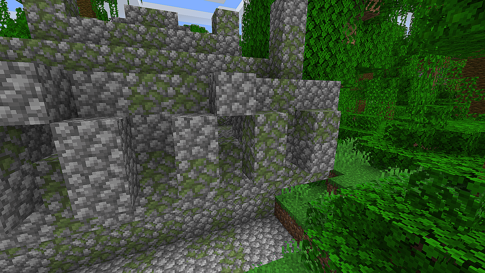
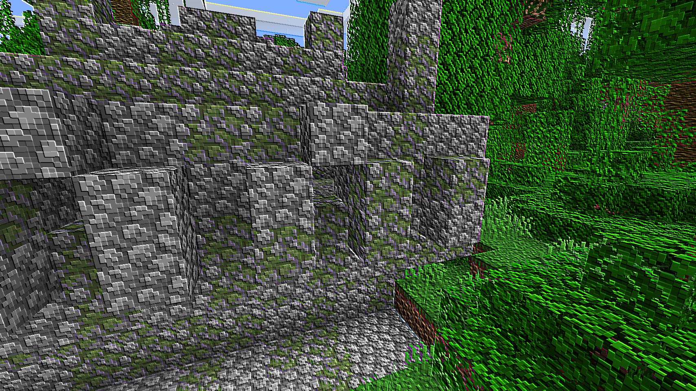
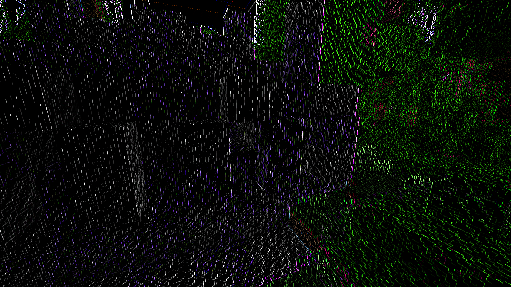

# Image Kernel Shaders
Image Kernel shader pack for Minecraft.

## Installation

Download and install [Forge](http://files.minecraftforge.net/) and the [OptiFine Mod](https://optifine.net/downloads).

Put the OptiFine mod `.jar` file into your minecraft mods folder. Make a `shaderpacks` folder in your minecraft folder and unzip [this shaderpack](https://github.com/55c3/kernel-shaders/releases).

Once there is a release of the [Iris mod](https://github.com/IrisShaders/Iris), this shaderpack will work with Fabric as well. The `fabric` branch has a mod that replicates this effect for Fabric users. Outline and shader modes are buggy currently.

## Usage
In the Shader Options, you can select a kernel and direction to try out. The direction creates subtle changes so play around with them to find what you like.

Some settings I enjoy:

* Emboss, North West
* Sobel, Left
* Outline, Contrast 25

Create an issue or submit a PR if you would like to see a kernel added to this shader.

If using the Fabric mod, use the `/kernel` command followed by `set` to set the kernel or `brightness`/`contrast` to set those values.

## Examples

Best seen in game but here is a small sample.

| Source | Sharpen | Emboss | Outline |
|-------|--------|---------|------|
|||||

* Sharpen - less blur between pixels
* Emboss - 3D effect on textures
* Outline - change of color
* Sobel - edge detection
